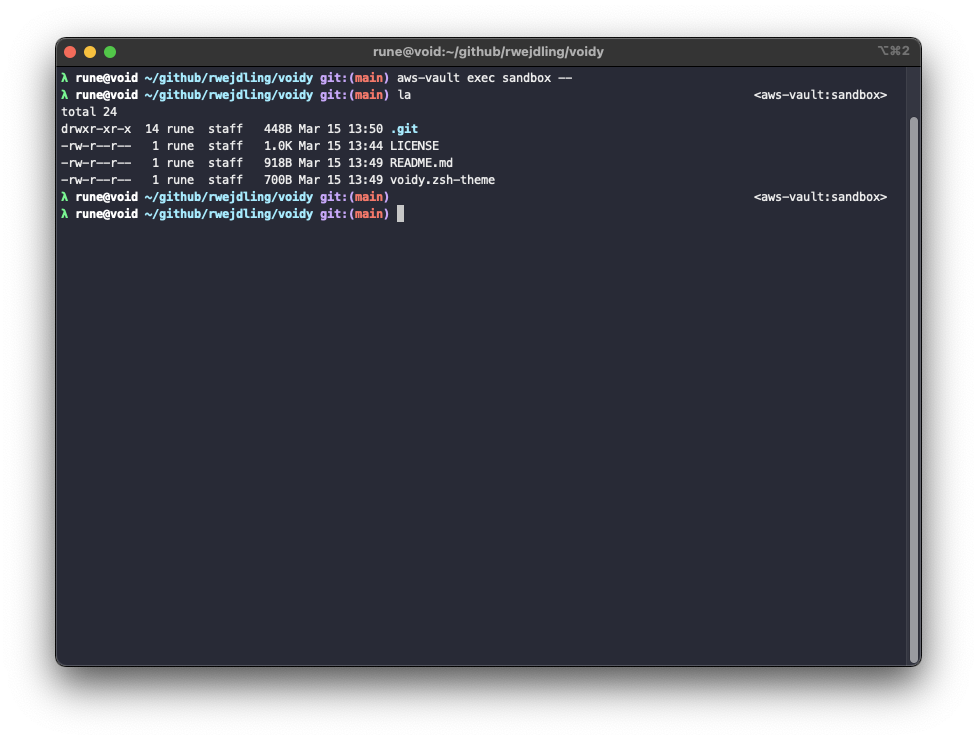

# Voidy ZSH theme

Simple ZSH theme for [Oh My Zsh](https://ohmyz.sh/)

Borrowing elements from [lambda](https://github.com/ohmyzsh/ohmyzsh/blob/master/themes/lambda.zsh-theme) and [robbyrussell](https://github.com/ohmyzsh/ohmyzsh/blob/master/themes/robbyrussell.zsh-theme) themes and adding active [aws-vault](https://github.com/99designs/aws-vault) profile to the right side of the prompt.



## Features

- Simple (and fast)
- `user@host` in prompt
- Full (or relative to `$HOME`) path in prompt
- Git info in prompt
- [aws-vault](https://github.com/99designs/aws-vault) profile in right prompt, similar to the way it's done by the [aws](https://github.com/ohmyzsh/ohmyzsh/tree/master/plugins/aws) plugin

## Install

1. Clone the repository:

    ```zsh
    git clone https://github.com/rwejdling/voidy.git ${ZSH_CUSTOM:-$HOME/.oh-my-zsh/custom}/themes/voidy
    ```

2. Set `ZSH_THEME="voidy/voidy"` in `~/.zshrc`.
